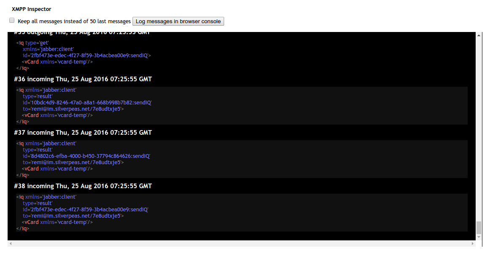

# xmpp-insector

JQuery plugin to help debug XMPP traffic.

Usage:

    $("#blockElementId").xmppInspector(stropheConnexion)

## Direct access to message stack

See in Javascript console 

    window._xmppinspector_messageStack

## Screenshot

